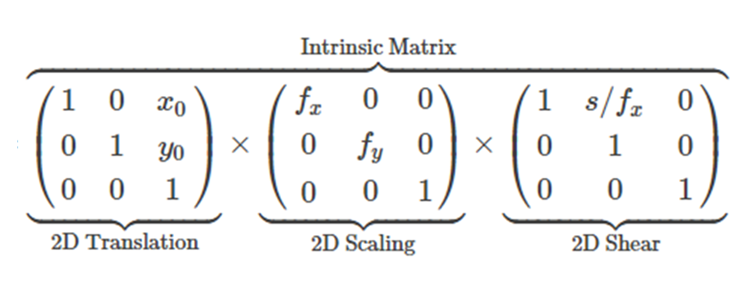
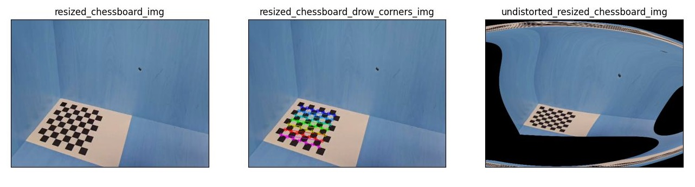
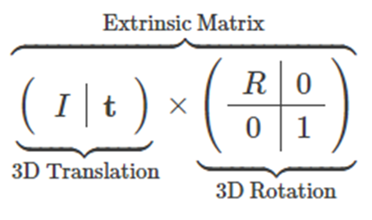
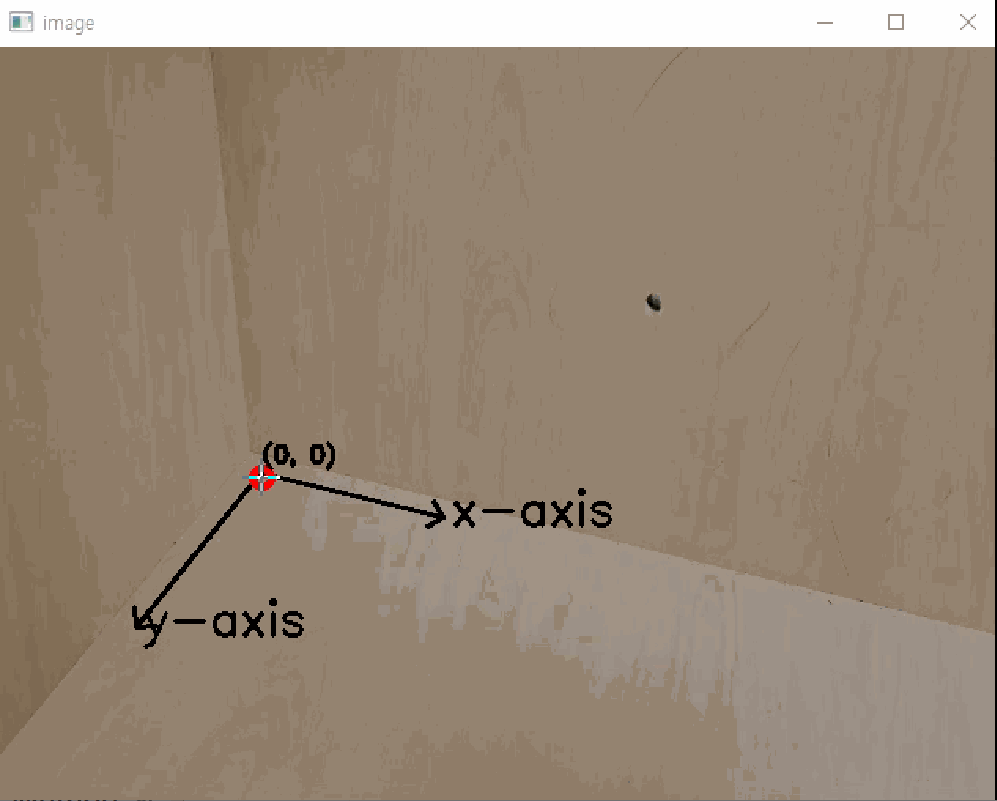
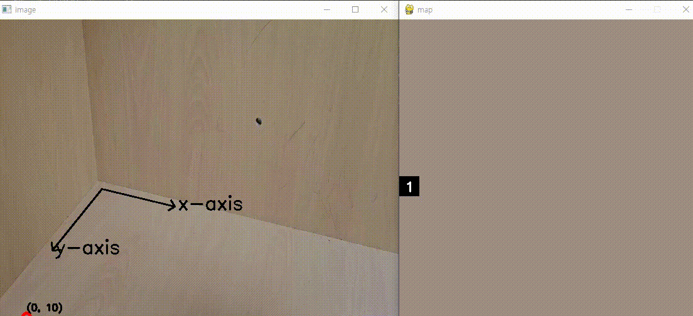

# 2d img xy to 3d world xyz Usage

### Dependencies
- numpy 1.2+
- opencv-python 4.8+
- pygame 2.5+

### Method
#### 1. Find Intrinsic parameters

  

#### 2. Camera Calibaration using intrinsic parameters

  

#### 3. Find Extrinsic parameters

  

#### 4. Pixel to World using Extrinsic parameters

  

#### ++ Visualization using pygame

  

### Usage
#### 1. Find Camera Parameter.ipynb
~~~
chessboard_img = cv2.imread('./img_folder/calibration_img.jpg')
Is_intrinsic_calibration = False
~~~
chessboard가 포함된 이미지의 경로 설정 / Is_intrinsic_calibration가 False 시 calibration을 진행 X

~~~
def mouse_callback(event, u, v, flags, param):
    if event == cv2.EVENT_LBUTTONDOWN:
        cv2.circle(test_image, (u, v), 6, (0, 0, 255), 3)
        uv_list.append([u, v])
        cv2.imshow("test_image", test_image)
        

cv2.imshow("test_image", test_image)
cv2.setMouseCallback("test_image", mouse_callback)
cv2.waitKey(0)
cv2.destroyAllWindows()
~~~
2D 이미지에서 바닥 좌표 4개를 선택

~~~
xyz_list = np.array([
    [0.0, 0.0, 0.001],
    [7.0, 0.0, 0.0],
    [0.0, 7.0, 0.002],
    [7.0, 7.0, 0.003]
], dtype="double")
~~~
선택한 4개의 좌표와 대응되는 3D world 상의 좌표 설정

#### 2. 2d img coordinates to 3d world coordinates.ipynb
~~~
image_origin = cv2.imread("./img_folder/frame_img.jpg")
image_origin = cv2.resize(image_origin, dsize = (640, 480), interpolation = cv2.INTER_AREA)
cv2.arrowedLine(image_origin, (167, 270), (283, 298), (0, 0, 0), thickness=2) # x축
cv2.arrowedLine(image_origin, (167, 270), (88, 368), (0, 0, 0), thickness=2) # y축
cv2.putText(image_origin, text='x-axis', org=(283+5, 298+5),\
        fontFace=cv2.FONT_HERSHEY_SIMPLEX, fontScale=1, color=(0, 0, 0), thickness=2)
cv2.putText(image_origin, text='y-axis', org=(88+5, 368+5),\
        fontFace=cv2.FONT_HERSHEY_SIMPLEX, fontScale=1, color=(0, 0, 0), thickness=2)

cv2.namedWindow("image")
cv2.setMouseCallback("image", mouse_callback)
cv2.waitKey(0)
cv2.destroyAllWindows()
~~~
chessboard를 제거한 이미지의 경로 설정 / cv2.imshow를 통해 출력된 이미지에 마우스를 움직여가며 (x, y)확인
